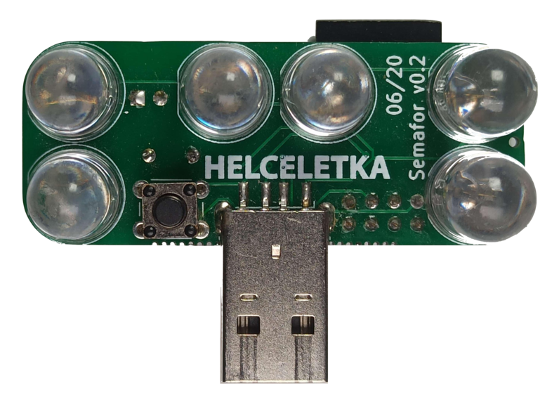
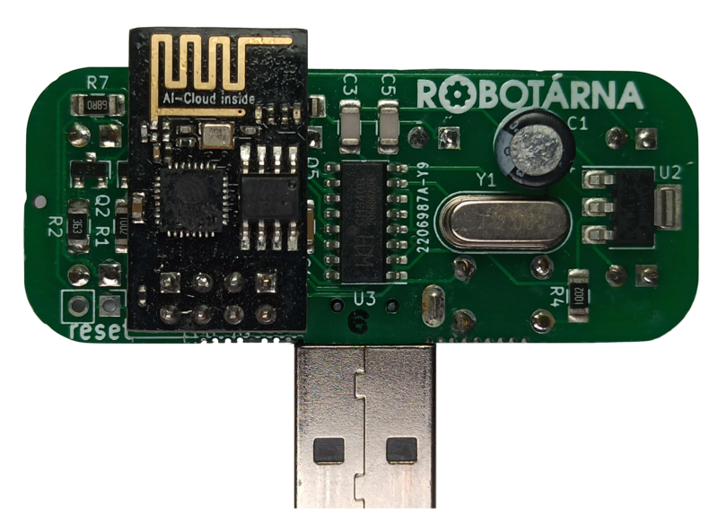

# Semafor

Traffic light gadget for outdoor games designed for [Helceletka.cz](https://helceletka.cz/).

## Hardware
Board is based on [ESP8266](https://en.wikipedia.org/wiki/ESP8266) microcontroller and large LEDs. It is powered by our power bank and can be managed via WiFi from the user's phone.

## Software
The software is written in [PlatformIO](https://platformio.org/) and is based on the Arduino framework.

  	<td></td>
	<td></td>

